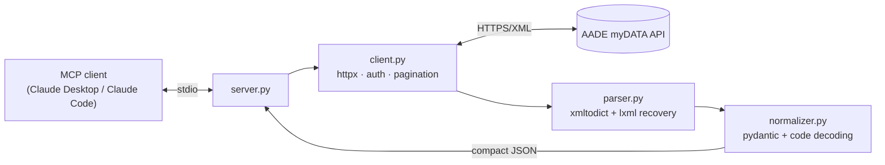

# mydata-mcp

**Read-only MCP server for the Greek AADE [myDATA](https://www.aade.gr/mydata) e-books API.**

Ask Claude (or any MCP client) questions about your business's invoices, income,
and expenses — in plain language. All myDATA codes (document types, VAT
categories, E3 classifications) are decoded into human-readable bilingual labels
before they ever reach the model.

[](https://github.com/GabrielNika/mydata-mcp/actions/workflows/ci.yml)


> ⚠️ Unofficial project — not affiliated with AADE. Strictly **read-only**: no
> write endpoint of the myDATA API is ever called.

## What can you ask?

- *"Ποια τιμολόγια έλαβα από προμηθευτές τον Ιούλιο;"*
- *"What was my gross margin in July 2026?"*
- *"Who are my top 5 suppliers by spend this quarter?"*
- *"Show me all credit notes I issued last month."*

## Features

- **4 tools** — received documents, transmitted documents, income summary,
  expense summary, with date/VAT/type filters and transparent pagination.
- **3 resources** — full myDATA code tables (invoice types, VAT categories,
  classifications) the model can consult on demand.
- **1 prompt** — `monthly_review` generates a complete monthly business review.
- **Battle-tested XML handling** — survives myDATA's escaped/nested and
  occasionally malformed XML responses via lxml recovery mode.
- **Compact output** — clean, typed JSON instead of raw XML dumps; details are
  opt-in per call, so token usage stays low.

## Architecture



## Quickstart

### 1. Get myDATA credentials

Register at [mydata.aade.gr](https://www.aade.gr/mydata) to obtain your
`user_id` and `subscription_key`.

### 2. Configure your MCP client

**Claude Desktop** (`claude_desktop_config.json`) or **Claude Code**
(`claude mcp add`):

```json
{
  "mcpServers": {
    "mydata": {
      "command": "uvx",
      "args": ["--from", "git+https://github.com/GabrielNika/mydata-mcp", "mydata-mcp"],
      "env": {
        "MYDATA_USER_ID": "your-user-id",
        "MYDATA_SUBSCRIPTION_KEY": "your-subscription-key"
      }
    }
  }
}
```

For a local checkout, use `"args": ["--from", "/path/to/mydata-mcp", "mydata-mcp"]`.

### 3. Ask away

Try the built-in prompt: `monthly_review(month=7, year=2026)`.

## Tools

| Tool | myDATA endpoint | Description |
|---|---|---|
| `get_received_documents` | `RequestDocs` | Documents received from suppliers |
| `get_transmitted_documents` | `RequestTransmittedDocs` | Documents you issued |
| `get_income_summary` | `RequestMyIncome` | Income bookings per E3 classification |
| `get_expense_summary` | `RequestMyExpenses` | Expense bookings per E3 classification |

Common parameters: `date_from` / `date_to` (ISO or `dd/MM/yyyy`),
`counterpart_vat`, `invoice_type`, `include_details`, `max_results`.
Every response carries `page_info: {has_more, next_mark}`.

## Resources

| URI | Contents |
|---|---|
| `mydata://codes/invoice-types` | Document types 1.1–17.6 (EN + EL) |
| `mydata://codes/vat-categories` | VAT categories with rates |
| `mydata://codes/classifications` | E3/VAT classification categories & types |

## Configuration

| Variable | Required | Description |
|---|---|---|
| `MYDATA_USER_ID` | ✅ | AADE user id |
| `MYDATA_SUBSCRIPTION_KEY` | ✅ | AADE subscription key |
| `MYDATA_ENV` | — | `production` (default) or `sandbox` |

## Development

```bash
uv sync          # install
uv run pytest    # test (all HTTP mocked — no credentials needed)
uv run ruff check .
```

## License

MIT
