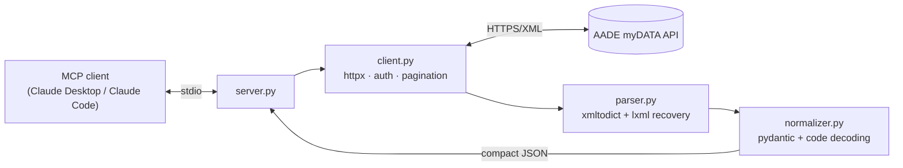

# myDATA MCP Server Implementation Plan

> **For agentic workers:** REQUIRED SUB-SKILL: Use superpowers:subagent-driven-development (recommended) or superpowers:executing-plans to implement this plan task-by-task. Steps use checkbox (`- [ ]`) syntax for tracking.

**Goal:** Build `mydata-mcp` — a read-only MCP server (Python/FastMCP) exposing the Greek AADE myDATA e-books API as 4 tools, 3 code-table resources, and 1 prompt, per the approved spec at `docs/superpowers/specs/2026-08-05-mydata-mcp-design.md`.

**Architecture:** Layered: `server.py` (MCP surface) → `client.py` (httpx, auth headers, pagination) → `parser.py` (XML→dict with lxml recovery) → `normalizer.py` (pydantic models + code decoding via `codes.py`). All HTTP is mocked in tests with respx; fixtures are anonymized myDATA XML.

**Tech Stack:** Python 3.11+, fastmcp ≥2.0, httpx, xmltodict, lxml, pydantic v2, uv + hatchling, pytest + pytest-asyncio + respx, ruff, GitHub Actions.

**Working directory:** `/Users/gabriel/Documents/Projects Gab/mydata-mcp` (all paths below are relative to it; run all commands from it).

**Domain primer (read this first):**
- myDATA is the Greek tax authority (AADE) e-invoicing platform. Every document has a `mark` (a monotonically increasing registration number). Read endpoints take `mark`, `dateFrom`/`dateTo` (format `dd/MM/yyyy`) and page via a continuation token (`nextPartitionKey` + `nextRowKey`).
- Responses are XML. Sometimes the payload arrives wrapped in a `<string>` element containing HTML-escaped — and occasionally malformed — inner XML. The parser must survive this (lxml `recover=True`).
- Every code (invoice type `1.1`, VAT category `1`, classification `E3_561_001`, `category1_1`) is opaque to an LLM; we decode all of them to bilingual labels.

---

### Task 1: Project scaffolding

**Files:**
- Create: `pyproject.toml`
- Create: `.gitignore`
- Create: `.env.example`
- Create: `LICENSE`
- Create: `src/mydata_mcp/__init__.py`
- Create: `tests/__init__.py` (empty)

- [ ] **Step 1: Set git identity for this repo (public GitHub repo)**

```bash
git config user.name "Gabriel Nika"
git config user.email "nikagabriel741@gmail.com"
```

(If the user's GitHub account uses a different email, adjust accordingly.)

- [ ] **Step 2: Create `pyproject.toml`**

```toml
[project]
name = "mydata-mcp"
version = "0.1.0"
description = "Read-only MCP server for the Greek AADE myDATA e-books API"
readme = "README.md"
requires-python = ">=3.11"
license = { text = "MIT" }
authors = [{ name = "Gabriel Nika" }]
keywords = ["mcp", "mydata", "aade", "greece", "invoices", "e-books", "llm"]
dependencies = [
    "fastmcp>=2.0",
    "httpx>=0.27",
    "xmltodict>=0.13",
    "lxml>=5.0",
    "pydantic>=2.0",
]

[project.scripts]
mydata-mcp = "mydata_mcp.server:main"

[dependency-groups]
dev = [
    "pytest>=8.0",
    "pytest-asyncio>=0.24",
    "respx>=0.21",
    "ruff>=0.6",
]

[build-system]
requires = ["hatchling"]
build-backend = "hatchling.build"

[tool.hatch.build.targets.wheel]
packages = ["src/mydata_mcp"]

[tool.pytest.ini_options]
asyncio_mode = "auto"
testpaths = ["tests"]

[tool.ruff]
line-length = 100
src = ["src", "tests"]

[tool.ruff.lint]
select = ["E", "F", "I", "UP"]
```

- [ ] **Step 3: Create `.gitignore`**

```gitignore
__pycache__/
*.py[cod]
.venv/
.pytest_cache/
.ruff_cache/
dist/
*.egg-info/
.env
```

- [ ] **Step 4: Create `.env.example`**

```bash
# AADE myDATA credentials — register at https://www.aade.gr/mydata
MYDATA_USER_ID=
MYDATA_SUBSCRIPTION_KEY=
# "production" (default) or "sandbox"
MYDATA_ENV=production
```

- [ ] **Step 5: Create `LICENSE` (MIT)**

```text
MIT License

Copyright (c) 2026 Gabriel Nika

Permission is hereby granted, free of charge, to any person obtaining a copy
of this software and associated documentation files (the "Software"), to deal
in the Software without restriction, including without limitation the rights
to use, copy, modify, merge, publish, distribute, sublicense, and/or sell
copies of the Software, and to permit persons to whom the Software is
furnished to do so, subject to the following conditions:

The above copyright notice and this permission notice shall be included in all
copies or substantial portions of the Software.

THE SOFTWARE IS PROVIDED "AS IS", WITHOUT WARRANTY OF ANY KIND, EXPRESS OR
IMPLIED, INCLUDING BUT NOT LIMITED TO THE WARRANTIES OF MERCHANTABILITY,
FITNESS FOR A PARTICULAR PURPOSE AND NONINFRINGEMENT. IN NO EVENT SHALL THE
AUTHORS OR COPYRIGHT HOLDERS BE LIABLE FOR ANY CLAIM, DAMAGES OR OTHER
LIABILITY, WHETHER IN AN ACTION OF CONTRACT, TORT OR OTHERWISE, ARISING FROM,
OUT OF OR IN CONNECTION WITH THE SOFTWARE OR THE USE OR OTHER DEALINGS IN THE
SOFTWARE.
```

- [ ] **Step 6: Create `src/mydata_mcp/__init__.py`**

```python
"""mydata-mcp — read-only MCP server for the Greek AADE myDATA API."""

__version__ = "0.1.0"
```

Also create an empty `tests/__init__.py`.

- [ ] **Step 7: Install and verify**

Run: `uv sync`
Expected: resolves and installs all dependencies plus the dev group without errors.

Run: `uv run python -c "import mydata_mcp; print(mydata_mcp.__version__)"`
Expected output: `0.1.0`

A `README.md` referenced by pyproject does not exist yet (written in Task 11). If `uv sync` complains about the missing readme, create a stub `README.md` containing only `# mydata-mcp` — Task 11 replaces it.

- [ ] **Step 8: Commit**

```bash
git add pyproject.toml .gitignore .env.example LICENSE src tests uv.lock README.md
git commit -m "chore: scaffold mydata-mcp package with uv and hatchling"
```

---

### Task 2: Code tables (`codes.py`)

Static myDATA code → bilingual label tables. Design decision (not a gap): the tables cover the codes a Greek SME actually meets; **unknown codes are passed through with `label=None`** — the decoding helpers never raise.

**Files:**
- Create: `src/mydata_mcp/codes.py`
- Test: `tests/test_codes.py`

- [ ] **Step 1: Write the failing tests**

Create `tests/test_codes.py`:

```python
from mydata_mcp import codes


def test_invoice_type_label():
    assert codes.invoice_type_label("1.1") == "Sales Invoice (Τιμολόγιο Πώλησης)"
    assert codes.invoice_type_label("11.1") == "Retail Sales Receipt (Απόδειξη Λιανικής Πώλησης)"


def test_invoice_type_label_unknown_returns_none():
    assert codes.invoice_type_label("99.99") is None
    assert codes.invoice_type_label(None) is None


def test_vat_rate():
    assert codes.vat_rate(1) == "24%"
    assert codes.vat_rate("2") == "13%"
    assert codes.vat_rate(7) == "0%"


def test_vat_rate_unknown_returns_none():
    assert codes.vat_rate(99) is None
    assert codes.vat_rate(None) is None


def test_classification_category_label():
    label = codes.classification_category_label("category1_1")
    assert label is not None
    assert "sale of goods" in label.lower()


def test_classification_type_label():
    label = codes.classification_type_label("E3_561_001")
    assert label is not None
    assert "wholesale" in label.lower()
    assert codes.classification_type_label("E3_UNKNOWN_CODE") is None


def test_payment_method_label():
    assert codes.payment_method_label(3) == "Cash (Μετρητά)"
    assert codes.payment_method_label("42") is None
```

- [ ] **Step 2: Run tests to verify they fail**

Run: `uv run pytest tests/test_codes.py -v`
Expected: FAIL — `ModuleNotFoundError: No module named 'mydata_mcp.codes'` (or ImportError).

- [ ] **Step 3: Write the implementation**

Create `src/mydata_mcp/codes.py`:

```python
"""Static myDATA code tables — single source of truth for code → label decoding.

Tables are curated from the AADE myDATA specification. They cover the codes a
Greek business commonly encounters; unknown codes decode to None and are passed
through unchanged by the normalizer.
"""

from typing import Any

INVOICE_TYPES: dict[str, dict[str, str]] = {
    "1.1": {"en": "Sales Invoice", "el": "Τιμολόγιο Πώλησης"},
    "1.2": {
        "en": "Sales Invoice / Intra-community Supplies",
        "el": "Τιμολόγιο Πώλησης / Ενδοκοινοτικές Παραδόσεις",
    },
    "1.3": {
        "en": "Sales Invoice / Third Country Supplies",
        "el": "Τιμολόγιο Πώλησης / Παραδόσεις Τρίτων Χωρών",
    },
    "1.4": {
        "en": "Sales Invoice / Sale on Behalf of Third Parties",
        "el": "Τιμολόγιο Πώλησης / Πώληση για Λογαριασμό Τρίτων",
    },
    "1.5": {
        "en": "Sales Invoice / Third-party Sales Clearance",
        "el": "Τιμολόγιο Πώλησης / Εκκαθάριση Πωλήσεων Τρίτων",
    },
    "1.6": {
        "en": "Sales Invoice / Supplementary Document",
        "el": "Τιμολόγιο Πώλησης / Συμπληρωματικό Παραστατικό",
    },
    "2.1": {"en": "Service Invoice", "el": "Τιμολόγιο Παροχής Υπηρεσιών"},
    "2.2": {
        "en": "Service Invoice / Intra-community Services",
        "el": "Τιμολόγιο Παροχής / Ενδοκοινοτική Παροχή Υπηρεσιών",
    },
    "2.3": {
        "en": "Service Invoice / Third Country Services",
        "el": "Τιμολόγιο Παροχής / Παροχή Υπηρεσιών σε λήπτη Τρίτης Χώρας",
    },
    "2.4": {
        "en": "Service Invoice / Supplementary Document",
        "el": "Τιμολόγιο Παροχής / Συμπληρωματικό Παραστατικό",
    },
    "3.1": {
        "en": "Proof of Expenditure (non-liable issuer)",
        "el": "Τίτλος Κτήσης (μη υπόχρεος Εκδότης)",
    },
    "3.2": {
        "en": "Proof of Expenditure (issuance refusal)",
        "el": "Τίτλος Κτήσης (άρνηση έκδοσης από υπόχρεο Εκδότη)",
    },
    "5.1": {"en": "Credit Invoice / Associated", "el": "Πιστωτικό Τιμολόγιο / Συσχετιζόμενο"},
    "5.2": {
        "en": "Credit Invoice / Non-Associated",
        "el": "Πιστωτικό Τιμολόγιο / Μη Συσχετιζόμενο",
    },
    "6.1": {"en": "Self-Delivery Record", "el": "Στοιχείο Αυτοπαράδοσης"},
    "6.2": {"en": "Self-Supply Record", "el": "Στοιχείο Ιδιοχρησιμοποίησης"},
    "7.1": {"en": "Contract - Income", "el": "Συμβόλαιο - Έσοδο"},
    "8.1": {"en": "Rents - Income", "el": "Ενοίκια - Έσοδο"},
    "8.2": {"en": "Accommodation Tax Receipt", "el": "Απόδειξη Είσπραξης Φόρου Διαμονής"},
    "9.3": {"en": "Dispatch Note", "el": "Δελτίο Αποστολής"},
    "11.1": {"en": "Retail Sales Receipt", "el": "Απόδειξη Λιανικής Πώλησης"},
    "11.2": {"en": "Retail Service Receipt", "el": "Απόδειξη Παροχής Υπηρεσιών"},
    "11.3": {"en": "Simplified Invoice", "el": "Απλοποιημένο Τιμολόγιο"},
    "11.4": {"en": "Retail Credit Note", "el": "Πιστωτικό Στοιχείο Λιανικής"},
    "11.5": {
        "en": "Retail Sales Receipt on Behalf of Third Parties",
        "el": "Απόδειξη Λιανικής Πώλησης για Λογαριασμό Τρίτων",
    },
    "13.1": {
        "en": "Expenses - Retail Purchases (domestic/foreign)",
        "el": "Έξοδα - Αγορές Λιανικών Συναλλαγών ημεδαπής/αλλοδαπής",
    },
    "13.2": {
        "en": "Retail Services Received (domestic/foreign)",
        "el": "Παροχή Λιανικών Συναλλαγών ημεδαπής/αλλοδαπής",
    },
    "13.3": {"en": "Shared Utilities", "el": "Κοινόχρηστα"},
    "13.4": {"en": "Subscriptions", "el": "Συνδρομές"},
    "13.30": {
        "en": "Self-Declared Entity Documents (retail)",
        "el": "Παραστατικά Οντότητας ως Αναγράφονται από την ίδια (Δυναμικό)",
    },
    "13.31": {
        "en": "Retail Credit Note (domestic/foreign)",
        "el": "Πιστωτικό Στοιχείο Λιανικής ημεδαπής/αλλοδαπής",
    },
    "14.1": {
        "en": "Invoice / Intra-community Acquisitions",
        "el": "Τιμολόγιο / Ενδοκοινοτικές Αποκτήσεις",
    },
    "14.2": {
        "en": "Invoice / Third Country Acquisitions",
        "el": "Τιμολόγιο / Αποκτήσεις Τρίτων Χωρών",
    },
    "14.3": {
        "en": "Invoice / Intra-community Services Received",
        "el": "Τιμολόγιο / Ενδοκοινοτική Λήψη Υπηρεσιών",
    },
    "14.4": {
        "en": "Invoice / Third Country Services Received",
        "el": "Τιμολόγιο / Λήψη Υπηρεσιών Τρίτων Χωρών",
    },
    "14.5": {
        "en": "EFKA and Insurance Organizations",
        "el": "ΕΦΚΑ και λοιποί Ασφαλιστικοί Οργανισμοί",
    },
    "14.30": {
        "en": "Self-Declared Entity Documents",
        "el": "Παραστατικά Οντότητας ως Αναγράφονται από την ίδια (Δυναμικό)",
    },
    "14.31": {"en": "Credit Note (domestic/foreign)", "el": "Πιστωτικό ημεδαπής/αλλοδαπής"},
    "15.1": {"en": "Contract - Expense", "el": "Συμβόλαιο - Έξοδο"},
    "16.1": {"en": "Rent - Expense", "el": "Ενοίκιο - Έξοδο"},
    "17.1": {"en": "Payroll", "el": "Μισθοδοσία"},
    "17.2": {"en": "Depreciation", "el": "Αποσβέσεις"},
    "17.3": {
        "en": "Other Income Adjustment Entries - Accounting Base",
        "el": "Λοιπές Εγγραφές Τακτοποίησης Εσόδων - Λογιστική Βάση",
    },
    "17.4": {
        "en": "Other Income Adjustment Entries - Tax Base",
        "el": "Λοιπές Εγγραφές Τακτοποίησης Εσόδων - Φορολογική Βάση",
    },
    "17.5": {
        "en": "Other Expense Adjustment Entries - Accounting Base",
        "el": "Λοιπές Εγγραφές Τακτοποίησης Εξόδων - Λογιστική Βάση",
    },
    "17.6": {
        "en": "Other Expense Adjustment Entries - Tax Base",
        "el": "Λοιπές Εγγραφές Τακτοποίησης Εξόδων - Φορολογική Βάση",
    },
}

VAT_CATEGORIES: dict[int, dict[str, Any]] = {
    1: {"rate": "24%", "en": "Standard rate 24%", "el": "ΦΠΑ συντελεστής 24%"},
    2: {"rate": "13%", "en": "Reduced rate 13%", "el": "ΦΠΑ συντελεστής 13%"},
    3: {"rate": "6%", "en": "Super-reduced rate 6%", "el": "ΦΠΑ συντελεστής 6%"},
    4: {"rate": "17%", "en": "Island standard rate 17%", "el": "ΦΠΑ συντελεστής 17% (νησιά)"},
    5: {"rate": "9%", "en": "Island reduced rate 9%", "el": "ΦΠΑ συντελεστής 9% (νησιά)"},
    6: {"rate": "4%", "en": "Island super-reduced rate 4%", "el": "ΦΠΑ συντελεστής 4% (νησιά)"},
    7: {"rate": "0%", "en": "Without VAT (0%)", "el": "Άνευ ΦΠΑ (0%)"},
    8: {"rate": None, "en": "Records without VAT", "el": "Εγγραφές χωρίς ΦΠΑ"},
    9: {"rate": "3%", "en": "Reduced rate 3%", "el": "ΦΠΑ συντελεστής 3%"},
    10: {"rate": "4%", "en": "Rate 4%", "el": "ΦΠΑ συντελεστής 4%"},
}

CLASSIFICATION_CATEGORIES: dict[str, dict[str, str]] = {
    "category1_1": {"en": "Revenue from sale of goods", "el": "Έσοδα από Πώληση Εμπορευμάτων"},
    "category1_2": {"en": "Revenue from sale of products", "el": "Έσοδα από Πώληση Προϊόντων"},
    "category1_3": {"en": "Revenue from provision of services", "el": "Έσοδα από Παροχή Υπηρεσιών"},
    "category1_4": {"en": "Revenue from sale of fixed assets", "el": "Έσοδα από Πώληση Παγίων"},
    "category1_5": {"en": "Other income and gains", "el": "Λοιπά Έσοδα/Κέρδη"},
    "category1_6": {
        "en": "Self-deliveries / self-use",
        "el": "Αυτοπαραδόσεις / Ιδιοχρησιμοποιήσεις",
    },
    "category1_7": {
        "en": "Revenue on behalf of third parties",
        "el": "Έσοδα για λογαριασμό τρίτων",
    },
    "category1_8": {"en": "Prior-year revenue", "el": "Έσοδα προηγούμενων χρήσεων"},
    "category1_9": {"en": "Deferred revenue", "el": "Έσοδα επομένων χρήσεων"},
    "category1_10": {
        "en": "Other revenue adjustment entries",
        "el": "Λοιπές Εγγραφές Τακτοποίησης Εσόδων",
    },
    "category1_95": {
        "en": "Other informational revenue data",
        "el": "Λοιπά Πληροφοριακά Στοιχεία Εσόδων",
    },
    "category2_1": {"en": "Purchases of goods", "el": "Αγορές Εμπορευμάτων"},
    "category2_2": {"en": "Purchases of raw materials", "el": "Αγορές Α'-Β' Υλών"},
    "category2_3": {"en": "Services received", "el": "Λήψη Υπηρεσιών"},
    "category2_4": {
        "en": "General expenses with VAT deduction right",
        "el": "Γενικά Έξοδα με δικαίωμα έκπτωσης ΦΠΑ",
    },
    "category2_5": {
        "en": "General expenses without VAT deduction right",
        "el": "Γενικά Έξοδα χωρίς δικαίωμα έκπτωσης ΦΠΑ",
    },
    "category2_6": {"en": "Personnel fees and benefits", "el": "Αμοιβές και Παροχές Προσωπικού"},
    "category2_7": {"en": "Purchases of fixed assets", "el": "Αγορές Παγίων"},
    "category2_8": {"en": "Depreciation of fixed assets", "el": "Αποσβέσεις Παγίων"},
    "category2_9": {
        "en": "Expenses on behalf of third parties",
        "el": "Έξοδα για λογαριασμό τρίτων",
    },
    "category2_10": {"en": "Prior-year expenses", "el": "Έξοδα προηγούμενων χρήσεων"},
    "category2_11": {"en": "Deferred expenses", "el": "Έξοδα επομένων χρήσεων"},
    "category2_12": {
        "en": "Other expense adjustment entries",
        "el": "Λοιπές Εγγραφές Τακτοποίησης Εξόδων",
    },
    "category2_95": {
        "en": "Other informational expense data",
        "el": "Λοιπά Πληροφοριακά Στοιχεία Εξόδων",
    },
    "category3": {"en": "Movement of goods", "el": "Διακίνηση"},
}

CLASSIFICATION_TYPES: dict[str, dict[str, str]] = {
    # Income (E3 revenue codes)
    "E3_561_001": {
        "en": "Wholesale sales of goods and services to businesses",
        "el": "Πωλήσεις αγαθών και υπηρεσιών Χονδρικές - Επιτηδευματιών",
    },
    "E3_561_002": {
        "en": "Wholesale sales under article 39a",
        "el": "Πωλήσεις αγαθών και υπηρεσιών Χονδρικές βάσει άρθρου 39α",
    },
    "E3_561_003": {
        "en": "Retail sales to private customers",
        "el": "Πωλήσεις αγαθών και υπηρεσιών Λιανικές - Ιδιωτική Πελατεία",
    },
    "E3_561_004": {
        "en": "Retail sales under article 39a",
        "el": "Πωλήσεις αγαθών και υπηρεσιών Λιανικές βάσει άρθρου 39α",
    },
    "E3_561_005": {
        "en": "Intra-EU foreign sales",
        "el": "Πωλήσεις αγαθών και υπηρεσιών Εξωτερικού Ενδοκοινοτικές",
    },
    "E3_561_006": {
        "en": "Third-country foreign sales",
        "el": "Πωλήσεις αγαθών και υπηρεσιών Εξωτερικού Τρίτες Χώρες",
    },
    "E3_561_007": {
        "en": "Other sales of goods and services",
        "el": "Πωλήσεις αγαθών και υπηρεσιών Λοιπά",
    },
    "E3_562": {"en": "Other ordinary income", "el": "Λοιπά συνήθη έσοδα"},
    "E3_563": {
        "en": "Credit interest and related income",
        "el": "Πιστωτικοί τόκοι και συναφή έσοδα",
    },
    "E3_564": {"en": "Credit exchange differences", "el": "Πιστωτικές συναλλαγματικές διαφορές"},
    "E3_565": {"en": "Income from participations", "el": "Έσοδα συμμετοχών"},
    "E3_566": {
        "en": "Gains from disposal of non-current assets",
        "el": "Κέρδη από διάθεση μη κυκλοφορούντων περιουσιακών στοιχείων",
    },
    "E3_567": {
        "en": "Gains from reversal of provisions and impairments",
        "el": "Κέρδη από αναστροφή προβλέψεων και απομειώσεων",
    },
    "E3_568": {"en": "Fair value measurement gains", "el": "Κέρδη από επιμέτρηση στην εύλογη αξία"},
    "E3_570": {"en": "Extraordinary income and gains", "el": "Ασυνήθη έσοδα και κέρδη"},
    "E3_595": {"en": "Self-production expenses", "el": "Έξοδα σε ιδιοπαραγωγή"},
    "E3_596": {"en": "Subsidies and grants", "el": "Επιδοτήσεις - Επιχορηγήσεις"},
    "E3_597": {
        "en": "Investment subsidies and grants",
        "el": "Επιδοτήσεις - Επιχορηγήσεις για επενδυτικούς σκοπούς",
    },
    # Expenses (E3 expense codes)
    "E3_102_001": {
        "en": "Purchases of goods - wholesale",
        "el": "Αγορές εμπορευμάτων χρήσης (καθαρό ποσό) - Χονδρικές",
    },
    "E3_102_002": {
        "en": "Purchases of goods - retail",
        "el": "Αγορές εμπορευμάτων χρήσης (καθαρό ποσό) - Λιανικές",
    },
    "E3_102_003": {
        "en": "Purchases of goods - intra-EU",
        "el": "Αγορές εμπορευμάτων χρήσης - Εξωτερικού Ενδοκοινοτικές",
    },
    "E3_102_004": {
        "en": "Purchases of goods - third countries",
        "el": "Αγορές εμπορευμάτων χρήσης - Εξωτερικού Τρίτες Χώρες",
    },
    "E3_102_005": {"en": "Purchases of goods - other", "el": "Αγορές εμπορευμάτων χρήσης - Λοιπά"},
    "E3_202_001": {
        "en": "Purchases of raw materials - wholesale",
        "el": "Αγορές πρώτων και βοηθητικών υλών - Χονδρικές",
    },
    "E3_202_002": {
        "en": "Purchases of raw materials - retail",
        "el": "Αγορές πρώτων και βοηθητικών υλών - Λιανικές",
    },
    "E3_202_003": {
        "en": "Purchases of raw materials - intra-EU",
        "el": "Αγορές πρώτων και βοηθητικών υλών - Εξωτερικού Ενδοκοινοτικές",
    },
    "E3_202_004": {
        "en": "Purchases of raw materials - third countries",
        "el": "Αγορές πρώτων και βοηθητικών υλών - Εξωτερικού Τρίτες Χώρες",
    },
    "E3_202_005": {
        "en": "Purchases of raw materials - other",
        "el": "Αγορές πρώτων και βοηθητικών υλών - Λοιπά",
    },
    "E3_581_001": {
        "en": "Employee benefits - gross wages",
        "el": "Παροχές σε εργαζόμενους - Μικτές αποδοχές",
    },
    "E3_581_002": {
        "en": "Employee benefits - employer contributions",
        "el": "Παροχές σε εργαζόμενους - Εργοδοτικές εισφορές",
    },
    "E3_581_003": {
        "en": "Employee benefits - other benefits",
        "el": "Παροχές σε εργαζόμενους - Λοιπές παροχές",
    },
    "E3_582": {"en": "Asset measurement losses", "el": "Ζημιές επιμέτρησης περιουσιακών στοιχείων"},
    "E3_583": {"en": "Debit exchange differences", "el": "Χρεωστικές συναλλαγματικές διαφορές"},
    "E3_584": {
        "en": "Losses from disposal of non-current assets",
        "el": "Ζημιές από διάθεση μη κυκλοφορούντων περιουσιακών στοιχείων",
    },
    "E3_586": {
        "en": "Debit interest and related expenses",
        "el": "Χρεωστικοί τόκοι και συναφή έξοδα",
    },
    "E3_587": {"en": "Depreciation", "el": "Αποσβέσεις"},
    "E3_588": {
        "en": "Extraordinary expenses, losses and fines",
        "el": "Ασυνήθη έξοδα, ζημιές και πρόστιμα",
    },
    "E3_589": {"en": "Provisions", "el": "Προβλέψεις"},
}

PAYMENT_METHODS: dict[int, dict[str, str]] = {
    1: {
        "en": "Domestic business bank account",
        "el": "Επαγγελματικός Λογαριασμός Πληρωμών Ημεδαπής",
    },
    2: {
        "en": "Foreign business bank account",
        "el": "Επαγγελματικός Λογαριασμός Πληρωμών Αλλοδαπής",
    },
    3: {"en": "Cash", "el": "Μετρητά"},
    4: {"en": "Check", "el": "Επιταγή"},
    5: {"en": "On credit", "el": "Επί πιστώσει"},
    6: {"en": "Web banking", "el": "Web banking"},
    7: {"en": "POS / e-POS", "el": "POS / e-POS"},
}


def _label(entry: dict[str, Any] | None) -> str | None:
    if not entry:
        return None
    en, el = entry.get("en"), entry.get("el")
    if en and el and en != el:
        return f"{en} ({el})"
    return en or el


def _safe_int(value: Any) -> int | None:
    try:
        return int(value)
    except (TypeError, ValueError):
        return None


def invoice_type_label(code: Any) -> str | None:
    if code is None:
        return None
    return _label(INVOICE_TYPES.get(str(code)))


def vat_rate(code: Any) -> str | None:
    entry = VAT_CATEGORIES.get(_safe_int(code))
    return entry.get("rate") if entry else None


def classification_category_label(code: Any) -> str | None:
    if code is None:
        return None
    return _label(CLASSIFICATION_CATEGORIES.get(str(code)))


def classification_type_label(code: Any) -> str | None:
    if code is None:
        return None
    return _label(CLASSIFICATION_TYPES.get(str(code)))


def payment_method_label(code: Any) -> str | None:
    return _label(PAYMENT_METHODS.get(_safe_int(code)))
```

Note: `VAT_CATEGORIES.get(_safe_int(code))` — `_safe_int` may return `None`; `dict.get(None)` is safe and returns `None`.

- [ ] **Step 4: Run tests to verify they pass**

Run: `uv run pytest tests/test_codes.py -v`
Expected: all 8 tests PASS.

- [ ] **Step 5: Commit**

```bash
git add src/mydata_mcp/codes.py tests/test_codes.py
git commit -m "feat: add myDATA code tables with bilingual label decoding"
```

---

### Task 3: Pydantic models (`models.py`)

**Files:**
- Create: `src/mydata_mcp/models.py`
- Test: `tests/test_models.py`

- [ ] **Step 1: Write the failing test**

Create `tests/test_models.py`:

```python
from mydata_mcp.models import Document, Party, Totals, TypeInfo


def test_document_serializes_compactly():
    doc = Document(
        mark="400001000000001",
        type=TypeInfo(code="1.1", label="Sales Invoice (Τιμολόγιο Πώλησης)"),
        issuer=Party(vat="111111111", name="DEMO SUPPLIER SA", country="GR"),
        totals=Totals(net=100.0, vat=24.0, gross=124.0),
        lines_count=1,
    )
    data = doc.model_dump(exclude_none=True)
    assert data["mark"] == "400001000000001"
    assert data["type"]["code"] == "1.1"
    assert data["totals"]["currency"] == "EUR"
    assert "uid" not in data
    assert "lines" not in data
```

- [ ] **Step 2: Run test to verify it fails**

Run: `uv run pytest tests/test_models.py -v`
Expected: FAIL — `ModuleNotFoundError: No module named 'mydata_mcp.models'`.

- [ ] **Step 3: Write the implementation**

Create `src/mydata_mcp/models.py`:

```python
"""Typed output models — the compact JSON shapes returned to MCP clients."""

from pydantic import BaseModel


class TypeInfo(BaseModel):
    code: str
    label: str | None = None


class Party(BaseModel):
    vat: str | None = None
    name: str | None = None
    country: str | None = None
    branch: int | None = None


class VatInfo(BaseModel):
    code: int | None = None
    rate: str | None = None


class Classification(BaseModel):
    category: str | None = None
    category_label: str | None = None
    type: str | None = None
    type_label: str | None = None
    amount: float | None = None


class LineItem(BaseModel):
    line_number: int | None = None
    net_value: float | None = None
    vat: VatInfo | None = None
    vat_amount: float | None = None
    classifications: list[Classification] = []


class Totals(BaseModel):
    net: float | None = None
    vat: float | None = None
    gross: float | None = None
    currency: str = "EUR"


class Document(BaseModel):
    mark: str | None = None
    uid: str | None = None
    cancelled_by_mark: str | None = None
    issue_date: str | None = None
    series: str | None = None
    number: str | None = None
    type: TypeInfo | None = None
    issuer: Party | None = None
    counterpart: Party | None = None
    totals: Totals | None = None
    lines_count: int = 0
    lines: list[LineItem] | None = None


class BookingRecord(BaseModel):
    counterpart_vat: str | None = None
    issue_date: str | None = None
    type: TypeInfo | None = None
    net_value: float | None = None
    vat_amount: float | None = None
    gross_value: float | None = None
    count: int | None = None
    min_mark: str | None = None
    max_mark: str | None = None
    classification: Classification | None = None
```

- [ ] **Step 4: Run test to verify it passes**

Run: `uv run pytest tests/test_models.py -v`
Expected: PASS.

- [ ] **Step 5: Commit**

```bash
git add src/mydata_mcp/models.py tests/test_models.py
git commit -m "feat: add pydantic output models"
```

---

### Task 4: XML parser with recovery (`parser.py`) + fixtures

**Files:**
- Create: `src/mydata_mcp/parser.py`
- Create: `tests/fixtures/received_docs_page1.xml`
- Create: `tests/fixtures/received_docs_page2.xml`
- Create: `tests/fixtures/received_docs_nested_malformed.xml`
- Create: `tests/fixtures/bookings_income.xml`
- Test: `tests/test_parser.py`

- [ ] **Step 1: Create the fixtures**

Create `tests/fixtures/received_docs_page1.xml` (2 invoices + continuation token; all VATs/marks/names are fake):

```xml
<?xml version="1.0" encoding="utf-8"?>
<RequestedDoc xmlns="http://www.aade.gr/myDATA/invoice/v1.0"
              xmlns:icls="https://www.aade.gr/myDATA/incomeClassificaton/v1.0">
  <continuationToken>
    <nextPartitionKey>1!8!partition2</nextPartitionKey>
    <nextRowKey>1!12!row2</nextRowKey>
  </continuationToken>
  <invoicesDoc>
    <invoice>
      <uid>0AA1BB2CC3DD4EE5FF6AA7BB8CC9DD0EE1FF2AA3</uid>
      <mark>400001000000001</mark>
      <issuer>
        <vatNumber>111111111</vatNumber>
        <country>GR</country>
        <branch>0</branch>
        <name>DEMO SUPPLIER SA</name>
      </issuer>
      <counterpart>
        <vatNumber>222222222</vatNumber>
        <country>GR</country>
        <branch>0</branch>
      </counterpart>
      <invoiceHeader>
        <series>A</series>
        <aa>101</aa>
        <issueDate>2026-07-10</issueDate>
        <invoiceType>1.1</invoiceType>
        <currency>EUR</currency>
      </invoiceHeader>
      <paymentMethods>
        <paymentMethodDetails>
          <type>3</type>
          <amount>124.00</amount>
        </paymentMethodDetails>
      </paymentMethods>
      <invoiceDetails>
        <lineNumber>1</lineNumber>
        <netValue>100.00</netValue>
        <vatCategory>1</vatCategory>
        <vatAmount>24.00</vatAmount>
        <incomeClassification>
          <icls:classificationType>E3_561_001</icls:classificationType>
          <icls:classificationCategory>category1_1</icls:classificationCategory>
          <icls:amount>100.00</icls:amount>
        </incomeClassification>
      </invoiceDetails>
      <invoiceSummary>
        <totalNetValue>100.00</totalNetValue>
        <totalVatAmount>24.00</totalVatAmount>
        <totalGrossValue>124.00</totalGrossValue>
      </invoiceSummary>
    </invoice>
    <invoice>
      <uid>1BB2CC3DD4EE5FF6AA7BB8CC9DD0EE1FF2AA3BB4</uid>
      <mark>400001000000002</mark>
      <issuer>
        <vatNumber>333333333</vatNumber>
        <country>GR</country>
        <branch>0</branch>
        <name>RETAIL VENDOR IKE</name>
      </issuer>
      <invoiceHeader>
        <series>0</series>
        <aa>555</aa>
        <issueDate>2026-07-12</issueDate>
        <invoiceType>11.1</invoiceType>
        <currency>EUR</currency>
      </invoiceHeader>
      <invoiceDetails>
        <lineNumber>1</lineNumber>
        <netValue>50.00</netValue>
        <vatCategory>2</vatCategory>
        <vatAmount>6.50</vatAmount>
      </invoiceDetails>
      <invoiceSummary>
        <totalNetValue>50.00</totalNetValue>
        <totalVatAmount>6.50</totalVatAmount>
        <totalGrossValue>56.50</totalGrossValue>
      </invoiceSummary>
    </invoice>
  </invoicesDoc>
</RequestedDoc>
```

Create `tests/fixtures/received_docs_page2.xml` (1 invoice, no continuation token):

```xml
<?xml version="1.0" encoding="utf-8"?>
<RequestedDoc xmlns="http://www.aade.gr/myDATA/invoice/v1.0">
  <invoicesDoc>
    <invoice>
      <uid>2CC3DD4EE5FF6AA7BB8CC9DD0EE1FF2AA3BB4CC5</uid>
      <mark>400001000000003</mark>
      <issuer>
        <vatNumber>444444444</vatNumber>
        <country>GR</country>
        <branch>0</branch>
        <name>THIRD SUPPLIER OE</name>
      </issuer>
      <counterpart>
        <vatNumber>222222222</vatNumber>
        <country>GR</country>
        <branch>0</branch>
      </counterpart>
      <invoiceHeader>
        <series>B</series>
        <aa>77</aa>
        <issueDate>2026-07-20</issueDate>
        <invoiceType>2.1</invoiceType>
        <currency>EUR</currency>
      </invoiceHeader>
      <invoiceDetails>
        <lineNumber>1</lineNumber>
        <netValue>200.00</netValue>
        <vatCategory>1</vatCategory>
        <vatAmount>48.00</vatAmount>
      </invoiceDetails>
      <invoiceSummary>
        <totalNetValue>200.00</totalNetValue>
        <totalVatAmount>48.00</totalVatAmount>
        <totalGrossValue>248.00</totalGrossValue>
      </invoiceSummary>
    </invoice>
  </invoicesDoc>
</RequestedDoc>
```

Create `tests/fixtures/received_docs_nested_malformed.xml`. This reproduces the real-world quirk: payload wrapped in `<string>`, HTML-escaped, and the issuer name contains a **raw unescaped `&`** after unescaping (which breaks expat and must be recovered by lxml). Write it as ONE line for the inner content (whitespace inside is fine, but keep the entities exactly as shown — `&amp;` in this file becomes a bare `&` in the inner XML after the outer parse):

```xml
<?xml version="1.0" encoding="utf-8"?>
<string xmlns="http://schemas.microsoft.com/2003/10/Serialization/">&lt;RequestedDoc xmlns="http://www.aade.gr/myDATA/invoice/v1.0"&gt;&lt;invoicesDoc&gt;&lt;invoice&gt;&lt;uid&gt;3DD4EE5FF6AA7BB8CC9DD0EE1FF2AA3BB4CC5DD6&lt;/uid&gt;&lt;mark&gt;400001000000009&lt;/mark&gt;&lt;issuer&gt;&lt;vatNumber&gt;555555555&lt;/vatNumber&gt;&lt;country&gt;GR&lt;/country&gt;&lt;branch&gt;0&lt;/branch&gt;&lt;name&gt;SMITH &amp; SONS&lt;/name&gt;&lt;/issuer&gt;&lt;invoiceHeader&gt;&lt;series&gt;A&lt;/series&gt;&lt;aa&gt;9&lt;/aa&gt;&lt;issueDate&gt;2026-07-25&lt;/issueDate&gt;&lt;invoiceType&gt;1.1&lt;/invoiceType&gt;&lt;currency&gt;EUR&lt;/currency&gt;&lt;/invoiceHeader&gt;&lt;invoiceSummary&gt;&lt;totalNetValue&gt;10.00&lt;/totalNetValue&gt;&lt;totalVatAmount&gt;2.40&lt;/totalVatAmount&gt;&lt;totalGrossValue&gt;12.40&lt;/totalGrossValue&gt;&lt;/invoiceSummary&gt;&lt;/invoice&gt;&lt;/invoicesDoc&gt;&lt;/RequestedDoc&gt;</string>
```

Create `tests/fixtures/bookings_income.xml`:

```xml
<?xml version="1.0" encoding="utf-8"?>
<RequestedBookInfo xmlns="http://www.aade.gr/myDATA/bookInfo/v1.0">
  <booksInfo>
    <counterVatNumber>555555555</counterVatNumber>
    <issueDate>2026-07-31</issueDate>
    <invType>1.1</invType>
    <netValue>1500.00</netValue>
    <vatAmount>360.00</vatAmount>
    <grossValue>1860.00</grossValue>
    <count>3</count>
    <minMark>400001000000101</minMark>
    <maxMark>400001000000103</maxMark>
    <classificationType>E3_561_001</classificationType>
    <classificationCategory>category1_1</classificationCategory>
  </booksInfo>
  <booksInfo>
    <counterVatNumber>666666666</counterVatNumber>
    <issueDate>2026-07-31</issueDate>
    <invType>2.1</invType>
    <netValue>800.00</netValue>
    <vatAmount>192.00</vatAmount>
    <grossValue>992.00</grossValue>
    <count>1</count>
    <minMark>400001000000104</minMark>
    <maxMark>400001000000104</maxMark>
    <classificationType>E3_561_003</classificationType>
    <classificationCategory>category1_3</classificationCategory>
  </booksInfo>
</RequestedBookInfo>
```

- [ ] **Step 2: Write the failing tests**

Create `tests/test_parser.py`:

```python
from pathlib import Path

from mydata_mcp.parser import parse_mydata_xml

FIXTURES = Path(__file__).parent / "fixtures"


def _load(name: str) -> str:
    return (FIXTURES / name).read_text(encoding="utf-8")


def test_parses_wellformed_response():
    parsed = parse_mydata_xml(_load("received_docs_page1.xml"))
    root = parsed["RequestedDoc"]
    invoices = root["invoicesDoc"]["invoice"]
    assert len(invoices) == 2
    assert invoices[0]["mark"] == "400001000000001"
    assert root["continuationToken"]["nextPartitionKey"] == "1!8!partition2"


def test_strips_namespace_prefixes():
    parsed = parse_mydata_xml(_load("received_docs_page1.xml"))
    line = parsed["RequestedDoc"]["invoicesDoc"]["invoice"][0]["invoiceDetails"]
    classification = line["incomeClassification"]
    # icls: prefixes must be stripped so the normalizer sees plain keys
    assert classification["classificationType"] == "E3_561_001"
    assert classification["classificationCategory"] == "category1_1"


def test_recovers_nested_malformed_response():
    parsed = parse_mydata_xml(_load("received_docs_nested_malformed.xml"))
    invoice = parsed["RequestedDoc"]["invoicesDoc"]["invoice"]
    assert invoice["mark"] == "400001000000009"
    assert invoice["issuer"]["vatNumber"] == "555555555"
    # lxml recovery may mangle the text around the bare "&" but structure survives
    assert "SMITH" in (invoice["issuer"]["name"] or "")


def test_single_invoice_is_dict_not_list():
    parsed = parse_mydata_xml(_load("received_docs_page2.xml"))
    invoice = parsed["RequestedDoc"]["invoicesDoc"]["invoice"]
    assert isinstance(invoice, dict)  # xmltodict quirk the normalizer must handle
```

- [ ] **Step 3: Run tests to verify they fail**

Run: `uv run pytest tests/test_parser.py -v`
Expected: FAIL — `ModuleNotFoundError: No module named 'mydata_mcp.parser'`.

- [ ] **Step 4: Write the implementation**

Create `src/mydata_mcp/parser.py`:

```python
"""Parse myDATA XML responses into plain dicts, surviving the API's quirks.

The API sometimes wraps the payload in a <string> element containing
HTML-escaped inner XML, which is occasionally malformed (bare ampersands in
company names). Strategy: xmltodict first; on failure, lxml in recover mode.
Namespace prefixes (icls:, ecls:) are stripped so consumers see plain keys.
"""

import html
from typing import Any

import xmltodict
from lxml import etree


class ParseError(Exception):
    """Raised when a myDATA response cannot be parsed as XML."""


def parse_mydata_xml(xml_text: str) -> dict:
    parsed = _parse_with_recovery(xml_text)
    wrapper = parsed.get("string")
    if isinstance(wrapper, dict) and "#text" in wrapper:
        parsed = _parse_with_recovery(html.unescape(wrapper["#text"]))
    return _strip_namespaces(parsed)


def _parse_with_recovery(xml_text: str) -> dict:
    try:
        return xmltodict.parse(xml_text)
    except Exception:
        parser = etree.XMLParser(recover=True, encoding="utf-8")
        try:
            root = etree.fromstring(xml_text.encode("utf-8"), parser=parser)
        except Exception as exc:
            raise ParseError(f"myDATA returned unparseable XML: {exc}") from exc
        if root is None:
            raise ParseError("myDATA returned unparseable XML (empty document).")
        return xmltodict.parse(etree.tostring(root, encoding="utf-8"))


def _strip_namespaces(value: Any) -> Any:
    if isinstance(value, dict):
        return {
            (key if key.startswith("@") else key.split(":", 1)[-1]): _strip_namespaces(item)
            for key, item in value.items()
        }
    if isinstance(value, list):
        return [_strip_namespaces(item) for item in value]
    return value
```

- [ ] **Step 5: Run tests to verify they pass**

Run: `uv run pytest tests/test_parser.py -v`
Expected: all 4 tests PASS. If `test_recovers_nested_malformed_response` fails on the name assertion only, loosen it to `assert invoice["issuer"]["name"] is not None` — lxml recovery behavior around bare `&` differs slightly across libxml2 versions; structure assertions (mark, vatNumber) must still pass.

- [ ] **Step 6: Commit**

```bash
git add src/mydata_mcp/parser.py tests/test_parser.py tests/fixtures
git commit -m "feat: add XML parser with lxml recovery for malformed myDATA responses"
```

---

### Task 5: Normalizer — documents (`normalizer.py`)

**Files:**
- Create: `src/mydata_mcp/normalizer.py`
- Test: `tests/test_normalizer.py`

- [ ] **Step 1: Write the failing tests**

Create `tests/test_normalizer.py`:

```python
from pathlib import Path

from mydata_mcp.normalizer import normalize_documents
from mydata_mcp.parser import parse_mydata_xml

FIXTURES = Path(__file__).parent / "fixtures"


def _parsed(name: str) -> dict:
    return parse_mydata_xml((FIXTURES / name).read_text(encoding="utf-8"))


def test_normalizes_documents_compact():
    docs, continuation = normalize_documents(_parsed("received_docs_page1.xml"))
    assert len(docs) == 2
    first = docs[0]
    assert first.mark == "400001000000001"
    assert first.issue_date == "2026-07-10"
    assert first.type.code == "1.1"
    assert first.type.label == "Sales Invoice (Τιμολόγιο Πώλησης)"
    assert first.issuer.vat == "111111111"
    assert first.counterpart.vat == "222222222"
    assert first.totals.net == 100.0
    assert first.totals.gross == 124.0
    assert first.lines_count == 1
    assert first.lines is None  # compact by default
    assert continuation == {"nextPartitionKey": "1!8!partition2", "nextRowKey": "1!12!row2"}


def test_normalizes_documents_with_details():
    docs, _ = normalize_documents(_parsed("received_docs_page1.xml"), include_details=True)
    line = docs[0].lines[0]
    assert line.net_value == 100.0
    assert line.vat.code == 1
    assert line.vat.rate == "24%"
    cls = line.classifications[0]
    assert cls.type == "E3_561_001"
    assert "wholesale" in cls.type_label.lower()
    assert cls.category == "category1_1"
    assert cls.amount == 100.0


def test_retail_receipt_has_no_counterpart():
    docs, _ = normalize_documents(_parsed("received_docs_page1.xml"))
    receipt = docs[1]
    assert receipt.counterpart is None
    assert receipt.type.code == "11.1"


def test_single_invoice_response():
    docs, continuation = normalize_documents(_parsed("received_docs_page2.xml"))
    assert len(docs) == 1
    assert docs[0].mark == "400001000000003"
    assert continuation is None
```

- [ ] **Step 2: Run tests to verify they fail**

Run: `uv run pytest tests/test_normalizer.py -v`
Expected: FAIL — `ModuleNotFoundError: No module named 'mydata_mcp.normalizer'`.

- [ ] **Step 3: Write the implementation**

Create `src/mydata_mcp/normalizer.py`:

```python
"""Turn parsed myDATA XML dicts into typed, code-decoded models.

All access is defensive (.get everywhere): the API omits elements freely, and
xmltodict returns a dict instead of a list when an element appears once.
"""

from typing import Any

from . import codes
from .models import (
    BookingRecord,
    Classification,
    Document,
    LineItem,
    Party,
    Totals,
    TypeInfo,
    VatInfo,
)


def _as_list(value: Any) -> list:
    if value is None:
        return []
    return value if isinstance(value, list) else [value]


def _text(value: Any) -> str | None:
    if isinstance(value, dict):
        value = value.get("#text")
    return str(value) if value is not None else None


def _to_float(value: Any) -> float | None:
    try:
        return float(_text(value))
    except (TypeError, ValueError):
        return None


def _to_int(value: Any) -> int | None:
    try:
        return int(_text(value))
    except (TypeError, ValueError):
        return None


def _type_info(code: Any) -> TypeInfo | None:
    code = _text(code)
    if not code:
        return None
    return TypeInfo(code=code, label=codes.invoice_type_label(code))


def _party(raw: Any) -> Party | None:
    if not isinstance(raw, dict):
        return None
    return Party(
        vat=_text(raw.get("vatNumber")),
        name=_text(raw.get("name")),
        country=_text(raw.get("country")),
        branch=_to_int(raw.get("branch")),
    )


def _classification(raw: dict) -> Classification:
    category = _text(raw.get("classificationCategory"))
    ctype = _text(raw.get("classificationType"))
    return Classification(
        category=category,
        category_label=codes.classification_category_label(category),
        type=ctype,
        type_label=codes.classification_type_label(ctype),
        amount=_to_float(raw.get("amount")),
    )


def _line(raw: dict) -> LineItem:
    vat_code = _to_int(raw.get("vatCategory"))
    classifications = [
        _classification(c)
        for key in ("incomeClassification", "expensesClassification")
        for c in _as_list(raw.get(key))
        if isinstance(c, dict)
    ]
    return LineItem(
        line_number=_to_int(raw.get("lineNumber")),
        net_value=_to_float(raw.get("netValue")),
        vat=VatInfo(code=vat_code, rate=codes.vat_rate(vat_code)) if vat_code is not None else None,
        vat_amount=_to_float(raw.get("vatAmount")),
        classifications=classifications,
    )


def _continuation(raw: Any) -> dict | None:
    if not isinstance(raw, dict):
        return None
    partition = _text(raw.get("nextPartitionKey"))
    row = _text(raw.get("nextRowKey"))
    if partition and row:
        return {"nextPartitionKey": partition, "nextRowKey": row}
    return None


def _document(raw: dict, include_details: bool) -> Document:
    header = raw.get("invoiceHeader") or {}
    summary = raw.get("invoiceSummary") or {}
    lines = [line for line in _as_list(raw.get("invoiceDetails")) if isinstance(line, dict)]
    return Document(
        mark=_text(raw.get("mark")),
        uid=_text(raw.get("uid")),
        cancelled_by_mark=_text(raw.get("cancelledByMark")),
        issue_date=_text(header.get("issueDate")),
        series=_text(header.get("series")),
        number=_text(header.get("aa")),
        type=_type_info(header.get("invoiceType")),
        issuer=_party(raw.get("issuer")),
        counterpart=_party(raw.get("counterpart")),
        totals=Totals(
            net=_to_float(summary.get("totalNetValue")),
            vat=_to_float(summary.get("totalVatAmount")),
            gross=_to_float(summary.get("totalGrossValue")),
            currency=_text(header.get("currency")) or "EUR",
        ),
        lines_count=len(lines),
        lines=[_line(line) for line in lines] if include_details else None,
    )


def normalize_documents(
    parsed: dict, *, include_details: bool = False
) -> tuple[list[Document], dict | None]:
    """Return (documents, continuation) from a RequestDocs/RequestTransmittedDocs response.

    continuation is {"nextPartitionKey": ..., "nextRowKey": ...} or None when
    the result set is complete.
    """
    root = parsed.get("RequestedDoc") or {}
    invoices = _as_list((root.get("invoicesDoc") or {}).get("invoice"))
    documents = [_document(inv, include_details) for inv in invoices if isinstance(inv, dict)]
    return documents, _continuation(root.get("continuationToken"))


def normalize_bookings(parsed: dict) -> tuple[list[BookingRecord], dict | None]:
    """Return (records, continuation) from a RequestMyIncome/RequestMyExpenses response."""
    root = parsed.get("RequestedBookInfo") or {}
    records: list[BookingRecord] = []
    for raw in _as_list(root.get("booksInfo")):
        if not isinstance(raw, dict):
            continue
        has_classification = raw.get("classificationCategory") or raw.get("classificationType")
        records.append(
            BookingRecord(
                counterpart_vat=_text(raw.get("counterVatNumber")),
                issue_date=_text(raw.get("issueDate")),
                type=_type_info(raw.get("invType")),
                net_value=_to_float(raw.get("netValue")),
                vat_amount=_to_float(raw.get("vatAmount")),
                gross_value=_to_float(raw.get("grossValue")),
                count=_to_int(raw.get("count")),
                min_mark=_text(raw.get("minMark")),
                max_mark=_text(raw.get("maxMark")),
                classification=_classification(raw) if has_classification else None,
            )
        )
    continuation = _continuation(
        {"nextPartitionKey": root.get("nextPartitionKey"), "nextRowKey": root.get("nextRowKey")}
    )
    return records, continuation
```

- [ ] **Step 4: Run tests to verify they pass**

Run: `uv run pytest tests/test_normalizer.py -v`
Expected: all 4 tests PASS.

- [ ] **Step 5: Commit**

```bash
git add src/mydata_mcp/normalizer.py tests/test_normalizer.py
git commit -m "feat: normalize documents with code decoding and pagination token extraction"
```

---

### Task 6: Normalizer — income/expense bookings

**Files:**
- Modify: `tests/test_normalizer.py` (append tests; implementation already landed in Task 5)

- [ ] **Step 1: Write the failing tests**

Append to `tests/test_normalizer.py`:

```python
from mydata_mcp.normalizer import normalize_bookings  # noqa: E402  (add to imports at top)


def test_normalizes_income_bookings():
    records, continuation = normalize_bookings(_parsed("bookings_income.xml"))
    assert len(records) == 2
    first = records[0]
    assert first.counterpart_vat == "555555555"
    assert first.net_value == 1500.0
    assert first.gross_value == 1860.0
    assert first.count == 3
    assert first.max_mark == "400001000000103"
    assert first.type.code == "1.1"
    assert first.classification.type == "E3_561_001"
    assert "wholesale" in first.classification.type_label.lower()
    assert "sale of goods" in first.classification.category_label.lower()
    assert continuation is None


def test_bookings_from_empty_response():
    records, continuation = normalize_bookings({"RequestedBookInfo": None})
    assert records == []
    assert continuation is None
```

(Merge the `normalize_bookings` import into the existing `from mydata_mcp.normalizer import ...` line at the top of the file instead of a separate import.)

- [ ] **Step 2: Run tests**

Run: `uv run pytest tests/test_normalizer.py -v`
Expected: the two new tests PASS immediately (implementation shipped in Task 5). If either fails, fix `normalize_bookings` — do not weaken the test.

- [ ] **Step 3: Commit**

```bash
git add tests/test_normalizer.py
git commit -m "test: cover income/expense booking normalization"
```

---

### Task 7: HTTP client — settings, dates, error mapping (`client.py`)

**Files:**
- Create: `src/mydata_mcp/client.py`
- Test: `tests/test_client.py`

- [ ] **Step 1: Write the failing tests**

Create `tests/test_client.py`:

```python
from pathlib import Path

import pytest
import respx
from httpx import Response

from mydata_mcp.client import (
    PRODUCTION_BASE,
    SANDBOX_BASE,
    AuthenticationError,
    ConfigurationError,
    MyDataClient,
    MyDataError,
    RateLimitError,
    Settings,
    load_settings,
    to_api_date,
)

FIXTURES = Path(__file__).parent / "fixtures"

TEST_SETTINGS = Settings(user_id="testuser", subscription_key="testkey", base_url=PRODUCTION_BASE)


def _fixture(name: str) -> str:
    return (FIXTURES / name).read_text(encoding="utf-8")


def test_to_api_date_accepts_iso_and_greek():
    assert to_api_date("2026-07-01") == "01/07/2026"
    assert to_api_date("01/07/2026") == "01/07/2026"


def test_to_api_date_rejects_garbage():
    with pytest.raises(ValueError, match="YYYY-MM-DD"):
        to_api_date("July 1st")


def test_load_settings_requires_credentials(monkeypatch):
    monkeypatch.delenv("MYDATA_USER_ID", raising=False)
    monkeypatch.delenv("MYDATA_SUBSCRIPTION_KEY", raising=False)
    with pytest.raises(ConfigurationError, match="MYDATA_USER_ID"):
        load_settings()


def test_load_settings_sandbox(monkeypatch):
    monkeypatch.setenv("MYDATA_USER_ID", "u")
    monkeypatch.setenv("MYDATA_SUBSCRIPTION_KEY", "k")
    monkeypatch.setenv("MYDATA_ENV", "sandbox")
    assert load_settings().base_url == SANDBOX_BASE


@respx.mock
async def test_authentication_error_is_actionable():
    respx.get(f"{PRODUCTION_BASE}RequestDocs").mock(return_value=Response(401))
    client = MyDataClient(settings=TEST_SETTINGS)
    with pytest.raises(AuthenticationError, match="MYDATA_SUBSCRIPTION_KEY"):
        await client.fetch_documents("RequestDocs", date_from="2026-07-01", date_to="2026-07-31")


@respx.mock
async def test_rate_limit_error_includes_retry_after():
    respx.get(f"{PRODUCTION_BASE}RequestDocs").mock(
        return_value=Response(429, headers={"Retry-After": "60"})
    )
    client = MyDataClient(settings=TEST_SETTINGS)
    with pytest.raises(RateLimitError, match="60"):
        await client.fetch_documents("RequestDocs", date_from="2026-07-01", date_to="2026-07-31")


BUSINESS_ERROR_XML = """<?xml version="1.0" encoding="utf-8"?>
<ResponseDoc xmlns="http://www.aade.gr/myDATA/responseDoc/v1.0">
  <response>
    <statusCode>ValidationError</statusCode>
    <errors>
      <error>
        <message>Invalid Greek VAT number</message>
        <code>204</code>
      </error>
    </errors>
  </response>
</ResponseDoc>"""


@respx.mock
async def test_business_error_inside_200_response_is_decoded():
    respx.get(f"{PRODUCTION_BASE}RequestDocs").mock(
        return_value=Response(200, text=BUSINESS_ERROR_XML)
    )
    client = MyDataClient(settings=TEST_SETTINGS)
    with pytest.raises(MyDataError, match="Invalid Greek VAT number"):
        await client.fetch_documents("RequestDocs", date_from="2026-07-01", date_to="2026-07-31")
```

- [ ] **Step 2: Run tests to verify they fail**

Run: `uv run pytest tests/test_client.py -v`
Expected: FAIL — `ModuleNotFoundError: No module named 'mydata_mcp.client'`.

- [ ] **Step 3: Write the implementation** (includes the fetch loops used by Task 8's tests — write the whole file now)

Create `src/mydata_mcp/client.py`:

```python
"""Async HTTP client for the AADE myDATA REST API (read-only endpoints).

Credentials come from the environment only and never appear in errors or logs.
"""

import os
from dataclasses import dataclass
from datetime import datetime

import httpx

from .models import BookingRecord, Document
from .normalizer import normalize_bookings, normalize_documents
from .parser import parse_mydata_xml

PRODUCTION_BASE = "https://mydatapi.aade.gr/myDATA/"
SANDBOX_BASE = "https://mydataapidev.aade.gr/"


class MyDataError(Exception):
    """Base error for myDATA client failures."""


class ConfigurationError(MyDataError):
    pass


class AuthenticationError(MyDataError):
    pass


class RateLimitError(MyDataError):
    pass


@dataclass(frozen=True)
class Settings:
    user_id: str
    subscription_key: str
    base_url: str


def load_settings() -> Settings:
    user_id = os.environ.get("MYDATA_USER_ID", "").strip()
    key = os.environ.get("MYDATA_SUBSCRIPTION_KEY", "").strip()
    if not user_id or not key:
        raise ConfigurationError(
            "Missing credentials: set the MYDATA_USER_ID and MYDATA_SUBSCRIPTION_KEY "
            "environment variables (register at https://www.aade.gr/mydata)."
        )
    env = os.environ.get("MYDATA_ENV", "production").strip().lower()
    base_url = SANDBOX_BASE if env == "sandbox" else PRODUCTION_BASE
    return Settings(user_id=user_id, subscription_key=key, base_url=base_url)


def to_api_date(value: str) -> str:
    """Accept YYYY-MM-DD or dd/MM/yyyy; return the API's dd/MM/yyyy."""
    for fmt in ("%Y-%m-%d", "%d/%m/%Y"):
        try:
            return datetime.strptime(value.strip(), fmt).strftime("%d/%m/%Y")
        except ValueError:
            continue
    raise ValueError(f"Unrecognized date {value!r}: use YYYY-MM-DD or dd/MM/yyyy.")


def _raise_on_business_error(parsed: dict) -> None:
    """myDATA sometimes reports errors inside an HTTP 200 body (ResponseDoc)."""
    root = parsed.get("ResponseDoc")
    if not isinstance(root, dict):
        return
    responses = root.get("response")
    responses = responses if isinstance(responses, list) else [responses]
    for resp in responses:
        if not isinstance(resp, dict):
            continue
        status = resp.get("statusCode")
        if status and str(status).lower() != "success":
            errors = (resp.get("errors") or {}).get("error")
            errors = errors if isinstance(errors, list) else ([errors] if errors else [])
            messages = [
                str(e["message"]) for e in errors if isinstance(e, dict) and e.get("message")
            ]
            detail = "; ".join(messages) or str(status)
            raise MyDataError(f"myDATA returned an error: {detail}")


class MyDataClient:
    def __init__(self, settings: Settings | None = None, timeout: float = 30.0):
        self.settings = settings or load_settings()
        self.timeout = timeout

    def _headers(self) -> dict[str, str]:
        return {
            "aade-user-id": self.settings.user_id,
            "Ocp-Apim-Subscription-Key": self.settings.subscription_key,
            "Accept": "application/xml",
        }

    async def _get(self, endpoint: str, params: dict) -> str:
        url = f"{self.settings.base_url}{endpoint}"
        async with httpx.AsyncClient(timeout=self.timeout) as http:
            response = await http.get(url, params=params, headers=self._headers())
        if response.status_code in (401, 403):
            raise AuthenticationError(
                "myDATA authentication failed — check MYDATA_USER_ID and MYDATA_SUBSCRIPTION_KEY."
            )
        if response.status_code == 429:
            retry_after = response.headers.get("Retry-After")
            hint = f" Retry after {retry_after} seconds." if retry_after else ""
            raise RateLimitError(f"myDATA rate limit exceeded.{hint}")
        if response.status_code >= 400:
            raise MyDataError(
                f"myDATA request to {endpoint} failed with HTTP {response.status_code}."
            )
        return response.text

    async def fetch_documents(
        self,
        endpoint: str,
        *,
        date_from: str,
        date_to: str,
        counterpart_vat: str | None = None,
        invoice_type: str | None = None,
        include_details: bool = False,
        max_results: int = 200,
    ) -> tuple[list[Document], bool]:
        """Fetch from RequestDocs or RequestTransmittedDocs, following continuation tokens.

        Returns (documents, has_more). has_more is True when results were
        truncated at max_results or a continuation token remained unconsumed.
        """
        params: dict = {
            "mark": 0,
            "dateFrom": to_api_date(date_from),
            "dateTo": to_api_date(date_to),
        }
        if counterpart_vat:
            params["counterVatNumber"] = counterpart_vat
        if invoice_type:
            params["invType"] = invoice_type

        documents: list[Document] = []
        continuation: dict | None = None
        while True:
            page_params = dict(params)
            if continuation:
                page_params.update(continuation)
            xml_text = await self._get(endpoint, page_params)
            parsed = parse_mydata_xml(xml_text)
            _raise_on_business_error(parsed)
            batch, continuation = normalize_documents(parsed, include_details=include_details)
            documents.extend(batch)
            if continuation is None or len(documents) >= max_results:
                break
        has_more = continuation is not None or len(documents) > max_results
        return documents[:max_results], has_more

    async def fetch_bookings(
        self,
        endpoint: str,
        *,
        date_from: str,
        date_to: str,
        counterpart_vat: str | None = None,
        max_results: int = 200,
    ) -> tuple[list[BookingRecord], bool]:
        """Fetch from RequestMyIncome or RequestMyExpenses, following continuation tokens."""
        params: dict = {
            "dateFrom": to_api_date(date_from),
            "dateTo": to_api_date(date_to),
        }
        if counterpart_vat:
            params["counterVatNumber"] = counterpart_vat

        records: list[BookingRecord] = []
        continuation: dict | None = None
        while True:
            page_params = dict(params)
            if continuation:
                page_params.update(continuation)
            xml_text = await self._get(endpoint, page_params)
            parsed = parse_mydata_xml(xml_text)
            _raise_on_business_error(parsed)
            batch, continuation = normalize_bookings(parsed)
            records.extend(batch)
            if continuation is None or len(records) >= max_results:
                break
        has_more = continuation is not None or len(records) > max_results
        return records[:max_results], has_more
```

- [ ] **Step 4: Run tests to verify they pass**

Run: `uv run pytest tests/test_client.py -v`
Expected: all 7 tests PASS.

- [ ] **Step 5: Commit**

```bash
git add src/mydata_mcp/client.py tests/test_client.py
git commit -m "feat: add myDATA HTTP client with settings, date conversion, and error mapping"
```

---

### Task 8: HTTP client — pagination behavior

**Files:**
- Modify: `tests/test_client.py` (append tests; implementation landed in Task 7)

- [ ] **Step 1: Write the tests**

Append to `tests/test_client.py`:

```python
@respx.mock
async def test_pagination_follows_continuation_token():
    route = respx.get(f"{PRODUCTION_BASE}RequestDocs")
    route.side_effect = [
        Response(200, text=_fixture("received_docs_page1.xml")),
        Response(200, text=_fixture("received_docs_page2.xml")),
    ]
    client = MyDataClient(settings=TEST_SETTINGS)
    docs, has_more = await client.fetch_documents(
        "RequestDocs", date_from="2026-07-01", date_to="2026-07-31"
    )
    assert len(docs) == 3
    assert has_more is False
    assert route.call_count == 2
    second_url = str(route.calls[1].request.url)
    assert "nextPartitionKey" in second_url
    assert "nextRowKey" in second_url


@respx.mock
async def test_pagination_stops_at_max_results():
    route = respx.get(f"{PRODUCTION_BASE}RequestDocs")
    route.side_effect = [Response(200, text=_fixture("received_docs_page1.xml"))]
    client = MyDataClient(settings=TEST_SETTINGS)
    docs, has_more = await client.fetch_documents(
        "RequestDocs", date_from="2026-07-01", date_to="2026-07-31", max_results=2
    )
    assert len(docs) == 2
    assert has_more is True  # continuation token was left unconsumed
    assert route.call_count == 1


@respx.mock
async def test_fetch_bookings():
    respx.get(f"{PRODUCTION_BASE}RequestMyIncome").mock(
        return_value=Response(200, text=_fixture("bookings_income.xml"))
    )
    client = MyDataClient(settings=TEST_SETTINGS)
    records, has_more = await client.fetch_bookings(
        "RequestMyIncome", date_from="2026-07-01", date_to="2026-07-31"
    )
    assert len(records) == 2
    assert has_more is False
    assert records[0].classification.type == "E3_561_001"
```

- [ ] **Step 2: Run tests**

Run: `uv run pytest tests/test_client.py -v`
Expected: all 10 tests PASS (implementation shipped in Task 7). If a pagination test fails, fix the loop in `client.py` — do not weaken the test.

- [ ] **Step 3: Commit**

```bash
git add tests/test_client.py
git commit -m "test: cover continuation-token pagination and max_results truncation"
```

---

### Task 9: MCP server — tools, resources, prompt (`server.py`)

**Files:**
- Create: `src/mydata_mcp/server.py`
- Test: `tests/test_server.py`

- [ ] **Step 1: Write the failing tests**

Create `tests/test_server.py`:

```python
import json
from pathlib import Path

import pytest
import respx
from fastmcp import Client
from httpx import Response

from mydata_mcp.client import PRODUCTION_BASE
from mydata_mcp.server import mcp

FIXTURES = Path(__file__).parent / "fixtures"


def _fixture(name: str) -> str:
    return (FIXTURES / name).read_text(encoding="utf-8")


def _payload(result):
    """Tolerate fastmcp version differences in structured-result access."""
    if getattr(result, "data", None) is not None:
        return result.data
    return json.loads(result.content[0].text)


@pytest.fixture
def creds(monkeypatch):
    monkeypatch.setenv("MYDATA_USER_ID", "testuser")
    monkeypatch.setenv("MYDATA_SUBSCRIPTION_KEY", "testkey")
    monkeypatch.delenv("MYDATA_ENV", raising=False)


@respx.mock
async def test_get_received_documents(creds):
    respx.get(f"{PRODUCTION_BASE}RequestDocs").mock(
        return_value=Response(200, text=_fixture("received_docs_page2.xml"))
    )
    async with Client(mcp) as client:
        result = await client.call_tool(
            "get_received_documents",
            {"date_from": "2026-07-01", "date_to": "2026-07-31"},
        )
    data = _payload(result)
    assert data["count"] == 1
    doc = data["documents"][0]
    assert doc["mark"] == "400001000000003"
    assert doc["type"]["label"] == "Service Invoice (Τιμολόγιο Παροχής Υπηρεσιών)"
    assert data["page_info"] == {"has_more": False, "next_mark": "400001000000003"}


@respx.mock
async def test_get_transmitted_documents_uses_correct_endpoint(creds):
    route = respx.get(f"{PRODUCTION_BASE}RequestTransmittedDocs").mock(
        return_value=Response(200, text=_fixture("received_docs_page2.xml"))
    )
    async with Client(mcp) as client:
        await client.call_tool(
            "get_transmitted_documents",
            {"date_from": "2026-07-01", "date_to": "2026-07-31", "counterpart_vat": "222222222"},
        )
    assert route.call_count == 1
    assert "counterVatNumber=222222222" in str(route.calls[0].request.url)


@respx.mock
async def test_get_income_summary(creds):
    respx.get(f"{PRODUCTION_BASE}RequestMyIncome").mock(
        return_value=Response(200, text=_fixture("bookings_income.xml"))
    )
    async with Client(mcp) as client:
        result = await client.call_tool(
            "get_income_summary", {"date_from": "2026-07-01", "date_to": "2026-07-31"}
        )
    data = _payload(result)
    assert data["count"] == 2
    assert data["records"][0]["classification"]["type"] == "E3_561_001"


@respx.mock
async def test_get_expense_summary_uses_correct_endpoint(creds):
    route = respx.get(f"{PRODUCTION_BASE}RequestMyExpenses").mock(
        return_value=Response(200, text=_fixture("bookings_income.xml"))
    )
    async with Client(mcp) as client:
        await client.call_tool(
            "get_expense_summary", {"date_from": "2026-07-01", "date_to": "2026-07-31"}
        )
    assert route.call_count == 1


async def test_missing_credentials_error_is_actionable(monkeypatch):
    monkeypatch.delenv("MYDATA_USER_ID", raising=False)
    monkeypatch.delenv("MYDATA_SUBSCRIPTION_KEY", raising=False)
    async with Client(mcp) as client:
        with pytest.raises(Exception, match="MYDATA_USER_ID"):
            await client.call_tool(
                "get_received_documents",
                {"date_from": "2026-07-01", "date_to": "2026-07-31"},
            )


async def test_invalid_date_error_is_actionable(creds):
    async with Client(mcp) as client:
        with pytest.raises(Exception, match="YYYY-MM-DD"):
            await client.call_tool(
                "get_received_documents",
                {"date_from": "bogus", "date_to": "2026-07-31"},
            )


async def test_code_table_resources():
    async with Client(mcp) as client:
        resources = await client.list_resources()
        uris = {str(r.uri) for r in resources}
        assert "mydata://codes/invoice-types" in uris
        assert "mydata://codes/vat-categories" in uris
        assert "mydata://codes/classifications" in uris
        content = await client.read_resource("mydata://codes/invoice-types")
        body = json.loads(content[0].text)
        assert body["1.1"]["en"] == "Sales Invoice"


async def test_monthly_review_prompt():
    async with Client(mcp) as client:
        prompts = await client.list_prompts()
        assert any(p.name == "monthly_review" for p in prompts)
        rendered = await client.get_prompt("monthly_review", {"month": 7, "year": 2026})
        text = rendered.messages[0].content.text
        assert "07/2026" in text
        assert "get_income_summary" in text
```

- [ ] **Step 2: Run tests to verify they fail**

Run: `uv run pytest tests/test_server.py -v`
Expected: FAIL — `ModuleNotFoundError: No module named 'mydata_mcp.server'`.

- [ ] **Step 3: Write the implementation**

Create `src/mydata_mcp/server.py`:

```python
"""myDATA MCP server — read-only access to Greek AADE myDATA e-books."""

from fastmcp import FastMCP
from fastmcp.exceptions import ToolError

from . import codes
from .client import MyDataClient, MyDataError
from .models import BookingRecord, Document

mcp = FastMCP(
    "myDATA",
    instructions=(
        "Read-only access to the Greek AADE myDATA e-books platform for one business. "
        "Fetch received/transmitted documents and income/expense summaries. All myDATA "
        "codes are decoded to bilingual labels; full code tables are available as "
        "resources under mydata://codes/. Dates accept YYYY-MM-DD or dd/MM/yyyy."
    ),
)


def _doc_response(docs: list[Document], has_more: bool) -> dict:
    marks = [int(d.mark) for d in docs if d.mark and d.mark.isdigit()]
    return {
        "count": len(docs),
        "documents": [d.model_dump(exclude_none=True) for d in docs],
        "page_info": {"has_more": has_more, "next_mark": str(max(marks)) if marks else None},
    }


def _booking_response(records: list[BookingRecord], has_more: bool) -> dict:
    marks = [int(r.max_mark) for r in records if r.max_mark and r.max_mark.isdigit()]
    return {
        "count": len(records),
        "records": [r.model_dump(exclude_none=True) for r in records],
        "page_info": {"has_more": has_more, "next_mark": str(max(marks)) if marks else None},
    }


async def _fetch_documents(endpoint: str, **kwargs) -> dict:
    try:
        client = MyDataClient()
        docs, has_more = await client.fetch_documents(endpoint, **kwargs)
    except (MyDataError, ValueError) as exc:
        raise ToolError(str(exc)) from exc
    return _doc_response(docs, has_more)


async def _fetch_bookings(endpoint: str, **kwargs) -> dict:
    try:
        client = MyDataClient()
        records, has_more = await client.fetch_bookings(endpoint, **kwargs)
    except (MyDataError, ValueError) as exc:
        raise ToolError(str(exc)) from exc
    return _booking_response(records, has_more)


@mcp.tool
async def get_received_documents(
    date_from: str,
    date_to: str,
    counterpart_vat: str | None = None,
    invoice_type: str | None = None,
    include_details: bool = False,
    max_results: int = 200,
) -> dict:
    """Fetch documents RECEIVED by your business (e.g. supplier invoices) from myDATA.

    Args:
        date_from: Start date, YYYY-MM-DD or dd/MM/yyyy.
        date_to: End date, YYYY-MM-DD or dd/MM/yyyy.
        counterpart_vat: Filter by the counterparty's VAT number (ΑΦΜ).
        invoice_type: Filter by myDATA document type code (e.g. "1.1");
            see resource mydata://codes/invoice-types.
        include_details: Include per-line details (VAT categories, classifications).
        max_results: Stop after this many documents; page_info.has_more signals truncation.
    """
    return await _fetch_documents(
        "RequestDocs",
        date_from=date_from,
        date_to=date_to,
        counterpart_vat=counterpart_vat,
        invoice_type=invoice_type,
        include_details=include_details,
        max_results=max_results,
    )


@mcp.tool
async def get_transmitted_documents(
    date_from: str,
    date_to: str,
    counterpart_vat: str | None = None,
    invoice_type: str | None = None,
    include_details: bool = False,
    max_results: int = 200,
) -> dict:
    """Fetch documents ISSUED by your business (sales invoices, receipts) from myDATA.

    Args:
        date_from: Start date, YYYY-MM-DD or dd/MM/yyyy.
        date_to: End date, YYYY-MM-DD or dd/MM/yyyy.
        counterpart_vat: Filter by the customer's VAT number (ΑΦΜ).
        invoice_type: Filter by myDATA document type code (e.g. "11.1");
            see resource mydata://codes/invoice-types.
        include_details: Include per-line details (VAT categories, classifications).
        max_results: Stop after this many documents; page_info.has_more signals truncation.
    """
    return await _fetch_documents(
        "RequestTransmittedDocs",
        date_from=date_from,
        date_to=date_to,
        counterpart_vat=counterpart_vat,
        invoice_type=invoice_type,
        include_details=include_details,
        max_results=max_results,
    )


@mcp.tool
async def get_income_summary(
    date_from: str,
    date_to: str,
    counterpart_vat: str | None = None,
    max_results: int = 200,
) -> dict:
    """Fetch INCOME bookings per classification from myDATA e-books (RequestMyIncome).

    Each record aggregates documents per counterparty/type/classification with
    net, VAT, and gross totals. Classification codes are decoded to labels.

    Args:
        date_from: Start date, YYYY-MM-DD or dd/MM/yyyy.
        date_to: End date, YYYY-MM-DD or dd/MM/yyyy.
        counterpart_vat: Filter by the counterparty's VAT number (ΑΦΜ).
        max_results: Stop after this many records; page_info.has_more signals truncation.
    """
    return await _fetch_bookings(
        "RequestMyIncome",
        date_from=date_from,
        date_to=date_to,
        counterpart_vat=counterpart_vat,
        max_results=max_results,
    )


@mcp.tool
async def get_expense_summary(
    date_from: str,
    date_to: str,
    counterpart_vat: str | None = None,
    max_results: int = 200,
) -> dict:
    """Fetch EXPENSE bookings per classification from myDATA e-books (RequestMyExpenses).

    Each record aggregates documents per counterparty/type/classification with
    net, VAT, and gross totals. Classification codes are decoded to labels.

    Args:
        date_from: Start date, YYYY-MM-DD or dd/MM/yyyy.
        date_to: End date, YYYY-MM-DD or dd/MM/yyyy.
        counterpart_vat: Filter by the counterparty's VAT number (ΑΦΜ).
        max_results: Stop after this many records; page_info.has_more signals truncation.
    """
    return await _fetch_bookings(
        "RequestMyExpenses",
        date_from=date_from,
        date_to=date_to,
        counterpart_vat=counterpart_vat,
        max_results=max_results,
    )


@mcp.resource("mydata://codes/invoice-types")
def invoice_types() -> dict:
    """All myDATA document type codes (1.1-17.6) with English and Greek labels."""
    return codes.INVOICE_TYPES


@mcp.resource("mydata://codes/vat-categories")
def vat_categories() -> dict:
    """myDATA VAT category codes with rates and labels."""
    return {str(code): entry for code, entry in codes.VAT_CATEGORIES.items()}


@mcp.resource("mydata://codes/classifications")
def classifications() -> dict:
    """myDATA income/expense classification categories and common E3 types."""
    return {
        "categories": codes.CLASSIFICATION_CATEGORIES,
        "types": codes.CLASSIFICATION_TYPES,
    }


@mcp.prompt
def monthly_review(month: int, year: int) -> str:
    """Produce a monthly business review from myDATA data."""
    period = f"{month:02d}/{year}"
    first_day = f"{year}-{month:02d}-01"
    return f"""You have read-only myDATA tools for a Greek business.

Prepare a business review for {period}:

1. Call get_income_summary and get_expense_summary from {first_day} to the last
   day of that month.
2. Call get_transmitted_documents and get_received_documents for the same period.
3. Read mydata://codes/classifications if any classification code is unfamiliar.

Report, in this order:
- Total income and expenses (net, VAT, gross) and the resulting gross margin.
- Top 5 counterparties by gross value on each side (suppliers and customers).
- Income and expense breakdown by classification category.
- Anything unusual: credit notes (types 5.1/5.2/11.4), cancelled documents, or
  outliers relative to the rest of the month.

Present amounts in EUR with thousands separators."""


def main() -> None:
    mcp.run()


if __name__ == "__main__":
    main()
```

- [ ] **Step 4: Run tests to verify they pass**

Run: `uv run pytest tests/test_server.py -v`
Expected: all 8 tests PASS.

Known version-sensitivity notes (fix the test accessor, not the server, if these bite):
- If `result.data` is unavailable in the installed fastmcp, `_payload` falls back to `content[0].text` — already handled.
- If `read_resource` content items expose `.text` differently, print the object and adapt the single accessor line.

- [ ] **Step 5: Run the full suite**

Run: `uv run pytest -v`
Expected: all tests across all files PASS.

- [ ] **Step 6: Verify the entrypoint starts**

Run: `uv run mydata-mcp < /dev/null; echo "exit: $?"`
Expected: the server starts on stdio and exits promptly when stdin closes, with exit code 0 and no traceback. (macOS has no `timeout` command; if the process hangs instead of exiting, stop it with Ctrl-C and investigate — a stdio MCP server must terminate on closed stdin.)

- [ ] **Step 7: Commit**

```bash
git add src/mydata_mcp/server.py tests/test_server.py
git commit -m "feat: add MCP server with 4 tools, 3 code-table resources, and monthly-review prompt"
```

---

### Task 10: Lint + CI

**Files:**
- Create: `.github/workflows/ci.yml`

- [ ] **Step 1: Run ruff and fix everything it reports**

Run: `uv run ruff check . --fix && uv run ruff format .`
Then: `uv run ruff check . && uv run ruff format --check .`
Expected: `All checks passed!` and no reformat needed.

Run: `uv run pytest -q`
Expected: all tests still PASS after formatting.

- [ ] **Step 2: Create `.github/workflows/ci.yml`**

```yaml
name: CI

on:
  push:
    branches: [main]
  pull_request:

jobs:
  test:
    runs-on: ubuntu-latest
    steps:
      - uses: actions/checkout@v4
      - uses: astral-sh/setup-uv@v5
        with:
          python-version: "3.12"
      - run: uv sync
      - run: uv run ruff check .
      - run: uv run ruff format --check .
      - run: uv run pytest -v
```

- [ ] **Step 3: Commit**

```bash
git add .github/workflows/ci.yml -A
git commit -m "ci: add GitHub Actions workflow with ruff and pytest"
```

---

### Task 11: README + real-API smoke test

**Files:**
- Create/Replace: `README.md`

- [ ] **Step 1: Write `README.md`**

```markdown
# mydata-mcp

**Read-only MCP server for the Greek AADE [myDATA](https://www.aade.gr/mydata) e-books API.**

Ask Claude (or any MCP client) questions about your business's invoices, income,
and expenses — in plain language. All myDATA codes (document types, VAT
categories, E3 classifications) are decoded into human-readable bilingual labels
before they ever reach the model.

[](https://github.com/GabrielNika/mydata-mcp/actions/workflows/ci.yml)


> ⚠️ Unofficial project — not affiliated with AADE. Strictly **read-only**: no
> write endpoint of the myDATA API is ever called.

## What can you ask?

- *"Ποια τιμολόγια έλαβα από προμηθευτές τον Ιούλιο;"*
- *"What was my gross margin in July 2026?"*
- *"Who are my top 5 suppliers by spend this quarter?"*
- *"Show me all credit notes I issued last month."*

## Features

- **4 tools** — received documents, transmitted documents, income summary,
  expense summary, with date/VAT/type filters and transparent pagination.
- **3 resources** — full myDATA code tables (invoice types, VAT categories,
  classifications) the model can consult on demand.
- **1 prompt** — `monthly_review` generates a complete monthly business review.
- **Battle-tested XML handling** — survives myDATA's escaped/nested and
  occasionally malformed XML responses via lxml recovery mode.
- **Compact output** — clean, typed JSON instead of raw XML dumps; details are
  opt-in per call, so token usage stays low.

## Architecture



## Quickstart

### 1. Get myDATA credentials

Register at [mydata.aade.gr](https://www.aade.gr/mydata) to obtain your
`user_id` and `subscription_key`.

### 2. Configure your MCP client

**Claude Desktop** (`claude_desktop_config.json`) or **Claude Code**
(`claude mcp add`):

```json
{
  "mcpServers": {
    "mydata": {
      "command": "uvx",
      "args": ["--from", "git+https://github.com/GabrielNika/mydata-mcp", "mydata-mcp"],
      "env": {
        "MYDATA_USER_ID": "your-user-id",
        "MYDATA_SUBSCRIPTION_KEY": "your-subscription-key"
      }
    }
  }
}
```

For a local checkout, use `"args": ["--from", "/path/to/mydata-mcp", "mydata-mcp"]`.

### 3. Ask away

Try the built-in prompt: `monthly_review(month=7, year=2026)`.

## Tools

| Tool | myDATA endpoint | Description |
|---|---|---|
| `get_received_documents` | `RequestDocs` | Documents received from suppliers |
| `get_transmitted_documents` | `RequestTransmittedDocs` | Documents you issued |
| `get_income_summary` | `RequestMyIncome` | Income bookings per E3 classification |
| `get_expense_summary` | `RequestMyExpenses` | Expense bookings per E3 classification |

Common parameters: `date_from` / `date_to` (ISO or `dd/MM/yyyy`),
`counterpart_vat`, `invoice_type`, `include_details`, `max_results`.
Every response carries `page_info: {has_more, next_mark}`.

## Resources

| URI | Contents |
|---|---|
| `mydata://codes/invoice-types` | Document types 1.1–17.6 (EN + EL) |
| `mydata://codes/vat-categories` | VAT categories with rates |
| `mydata://codes/classifications` | E3/VAT classification categories & types |

## Configuration

| Variable | Required | Description |
|---|---|---|
| `MYDATA_USER_ID` | ✅ | AADE user id |
| `MYDATA_SUBSCRIPTION_KEY` | ✅ | AADE subscription key |
| `MYDATA_ENV` | — | `production` (default) or `sandbox` |

## Development

```bash
uv sync          # install
uv run pytest    # test (all HTTP mocked — no credentials needed)
uv run ruff check .
```

## License

MIT
```

Adjust the GitHub username in badge/config URLs to the user's actual GitHub handle before pushing (ask the user if unknown).

- [ ] **Step 2: Verify README renders and suite is green**

Run: `uv run pytest -q && uv run ruff check .`
Expected: all tests pass, lint clean.

- [ ] **Step 3: Commit**

```bash
git add README.md
git commit -m "docs: add showcase README with architecture diagram and quickstart"
```

- [ ] **Step 4: Real-API smoke test (requires the user's real credentials — coordinate with the user; do NOT commit credentials)**

The credentials live in the SMDeli repo file `myDataCreds` (line 1 = user id, line 3 = subscription key). Run:

```bash
export MYDATA_USER_ID="<line 1 of myDataCreds>"
export MYDATA_SUBSCRIPTION_KEY="<line 3 of myDataCreds>"
uv run python - <<'EOF'
import asyncio
from mydata_mcp.client import MyDataClient

async def main():
    client = MyDataClient()
    docs, has_more = await client.fetch_documents(
        "RequestDocs", date_from="2026-07-01", date_to="2026-07-31", max_results=5
    )
    print(f"documents: {len(docs)}, has_more: {has_more}")
    for d in docs:
        print(d.mark, d.type.label if d.type else "?", (d.issuer.name if d.issuer else "?"))
    records, _ = await client.fetch_bookings(
        "RequestMyIncome", date_from="2026-07-01", date_to="2026-07-31", max_results=5
    )
    print(f"income records: {len(records)}")
    for r in records:
        print(r.counterpart_vat, r.net_value, r.classification.type if r.classification else "?")

asyncio.run(main())
EOF
```

Expected: document and income lines print without a traceback.

**If field names in the real `booksInfo` response differ from the fixtures** (the booking schema was written from the myDATA docs, not observed traffic): update `normalize_bookings` in `src/mydata_mcp/normalizer.py` AND `tests/fixtures/bookings_income.xml` to match reality, re-run `uv run pytest`, and commit the fix as
`fix: align booking normalization with live myDATA response schema`.

- [ ] **Step 5: Final full verification**

Run: `uv run pytest -v && uv run ruff check . && uv run ruff format --check .`
Expected: everything green. The project is ready to push to GitHub.

---

## Verification checklist (maps plan → spec)

- 4 read-only tools with filters, `include_details`, `max_results`, `page_info` → Tasks 7–9
- Code decoding for invoice types, VAT categories, classifications, payment methods → Task 2
- Compact document/booking output shapes → Tasks 3, 5, 6
- XML recovery for nested/malformed responses → Task 4
- Env-only config, production/sandbox, actionable config errors → Task 7, Task 9 error tests
- Error mapping 401/429/business-errors-in-200/parse/validation without stack traces or credentials → Tasks 7, 9
- 3 resources + 1 prompt (all three MCP primitives) → Task 9
- pytest + respx, anonymized fixtures incl. malformed variant → Tasks 4–9
- GitHub Actions CI with ruff + pytest → Task 10
- English showcase README with mermaid, tables, config snippets, disclaimer → Task 11
