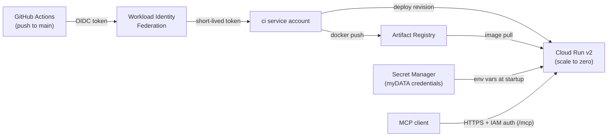

# Infrastructure

Complete GCP infrastructure for running the myDATA MCP server on Cloud Run,
managed with Terraform. Deploys are keyless (Workload Identity Federation) and
the service scales to zero — idle cost is effectively €0.



## File map

| File | Contents |
|---|---|
| `versions.tf` | Terraform/provider versions, GCS remote-state backend |
| `providers.tf` | google provider defaults (project, region) |
| `variables.tf` | inputs: `project_id`, `github_repository`, `region` |
| `services.tf` | project APIs, enabled as code |
| `artifact_registry.tf` | Docker repository + cleanup policies |
| `secrets.tf` | secret *envelopes* only — values are added out-of-band |
| `iam.tf` | least-privilege runtime service account |
| `cloud_run.tf` | the service: scaling, resources, secret-backed env vars |
| `github_ci.tf` | WIF pool/provider + CI service account and its grants |
| `outputs.tf` | service URL, registry URL, WIF provider, CI SA |

Not committed (see `*.example` templates): `terraform.tfvars` (project id,
repo), `backend.hcl` (state bucket name).

## Restore from zero

Everything below is reproducible on a fresh GCP project. Secrets values and
the two bootstrap resources (state bucket, budget) are the only manual steps —
deliberately kept outside Terraform (state needs a home before Terraform can
run; the budget outlives any single project).

```bash
# 0. Prerequisites: gcloud + terraform installed, gcloud auth login +
#    gcloud auth application-default login done.

# 1. Project + billing
gcloud projects create <PROJECT_ID> --name="myDATA MCP"
gcloud config set project <PROJECT_ID>
gcloud billing projects link <PROJECT_ID> --billing-account=<BILLING_ACCOUNT>

# 2. Billing guardrail (billing-account level, survives project teardown)
gcloud services enable billingbudgets.googleapis.com
gcloud billing budgets create --billing-account=<BILLING_ACCOUNT> \
  --display-name="guardrail-5eur" --budget-amount=5EUR \
  --threshold-rule=percent=0.5 --threshold-rule=percent=0.9 --threshold-rule=percent=1.0

# 3. Terraform state bucket (versioned, never public)
gcloud storage buckets create gs://<PROJECT_ID>-tfstate --location=europe-west1 \
  --uniform-bucket-level-access --public-access-prevention
gcloud storage buckets update gs://<PROJECT_ID>-tfstate --versioning

# 4. Terraform
cp terraform.tfvars.example terraform.tfvars   # fill in values
cp backend.hcl.example backend.hcl             # fill in bucket name
terraform init -backend-config=backend.hcl
terraform plan -out=plan.tfplan && terraform apply plan.tfplan

# 5. Secret values (interactive shell, never via files or CLI args)
read -s "SECRET?myDATA user id: "
printf '%s' "$SECRET" | gcloud secrets versions add mydata-user-id --data-file=-
unset SECRET
read -s "SECRET?myDATA subscription key: "
printf '%s' "$SECRET" | gcloud secrets versions add mydata-subscription-key --data-file=-
unset SECRET

# 6. First image (Cloud Run needs one before CI takes over; note amd64)
gcloud auth configure-docker europe-west1-docker.pkg.dev
docker build --platform linux/amd64 -t <REGISTRY_URL>/mydata-mcp:dev ../
docker push <REGISTRY_URL>/mydata-mcp:dev

# 7. GitHub repository variables (Settings → Secrets and variables → Actions
#    → Variables): GCP_PROJECT_ID, GCP_WIF_PROVIDER, GCP_CI_SERVICE_ACCOUNT —
#    values come from `terraform output`.
```

From then on, every push to `main` tests, builds, and deploys automatically.

## Day-2 operations

- **Deploy**: `git push` — nothing else. CI deploys the image tagged with the
  commit SHA; `terraform plan` stays clean because the service's `image` field
  is under `lifecycle.ignore_changes` (Terraform owns config, CI owns image).
- **Config change** (scaling, env, IAM): edit Terraform, `plan` → `apply`.
- **Secret rotation**: `gcloud secrets versions add ...` with the new value,
  then redeploy (revisions read `latest` at instance startup). Disable the old
  version once verified.
- **Access**: the service requires IAM auth (`roles/run.invoker`); anonymous
  requests are rejected at Google's front end with 403.
- **Teardown**: set `deletion_protection = false` on the Cloud Run service,
  `terraform destroy`, then delete the project. The state bucket and budget
  survive by design.
